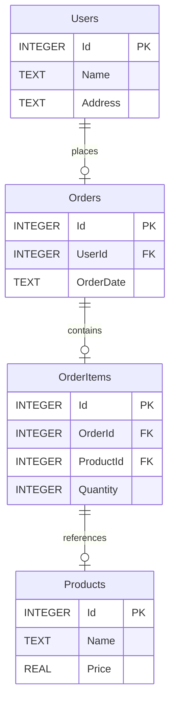

# Recipe: Create and Visualize Graph Structures with GraphTool in ScriptRunner

## Goal

Learn how to use the **GraphTool Plugin** to create and visualize graph structures such as 
Entity-Relationship Diagrams (ERDs), Class Diagrams, and Lineage Graphs. 
This recipe demonstrates generating a Mermaid diagram from graph data.

## Overview

This recipe covers:
1. Creating a graph structure from entities and relationships.
2. Using different graph plugins (ERD, ClassDiagram, Lineage).
3. Rendering graphs as diagrams in various formats (e.g., Mermaid, Graphviz, PlantUML).
4. Filtering and customizing the graph visualization.

By the end, you'll generate a **Mermaid ERD diagram** that represents the graph structure visually.

---

## Steps

### 1. Define Task Metadata

Add metadata to the script for identification and plugin requirements:

```csharp
/*
{
    "TaskCategory": "Plugins",
    "TaskName": "GraphTool Demo",
    "TaskDetail": "A test script for Mermaid diagram generation",
    "RequiredPlugins": ["GraphTool"]
}
*/
```

### 2. Initialize GraphTool and Logger

Create the required services and initialize the **GraphTool**:

```csharp
var logger = GetLogger("GraphPluginManager");
var pluginManager = new GraphPluginManager(logger: logger, erdPlugin: new ErdPlugin());
var graphTool = new GraphTool(pluginManager);
```

### 3. Load Entities and Relationships

Load entities and relationships (e.g., tables and foreign key relationships) into memory:

```csharp
var entities = db.LoadEntities(); // List of entities
var relationships = db.LoadRelationships(); // Relationships between entities
```

### 4. Generate Graph Data

Use the **ERD Plugin** to create a graph structure from the loaded entities and relationships. 
Optionally filter the graph by focusing on specific entities:

```csharp
string[] entityFilter = new[] { "Orders", "OrderItems", "Products" }; // Focused entities
var graphData = graphTool.CreateGraph(PluginType.Erd, entities, relationships, entityFilter);
```

### 5. Render and Visualize Graph

Render the graph as a **Mermaid ERD diagram** using the **GraphVisualization** service:

```csharp
var graphVisualization = new GraphVisualization();
var mermaidDiagram = graphVisualization.Render(graphData, TemplateType.MermaidErd);
Dump(mermaidDiagram); // Output the Mermaid diagram
```

---

## Example Script

Here’s the complete script for generating a Mermaid ERD diagram:

```csharp
/*
{
    "TaskCategory": "Plugins",
    "TaskName": "GraphTool Demo",
    "TaskDetail": "A test script for Mermaid diagram generation",
    "RequiredPlugins": ["GraphTool"]
}
*/

// Initialize services
var logger = GetLogger("GraphPluginManager");
var pluginManager = new GraphPluginManager(logger: logger, erdPlugin: new ErdPlugin());
var graphTool = new GraphTool(pluginManager);

// Load entities and relationships
var entities = db.LoadEntities();
var relationships = db.LoadRelationships();

// Specify the entity filter
string[] entityFilter = new[] { "Orders", "OrderItems", "Products" };

// Generate graph data
var graphData = graphTool.CreateGraph(PluginType.Erd, entities, relationships, entityFilter);

// Render the graph as a Mermaid ERD diagram
var graphVisualization = new GraphVisualization();
var mermaidDiagram = graphVisualization.Render(graphData, TemplateType.MermaidErd);

// Output the Mermaid diagram
Dump(mermaidDiagram);

// Task completed
return "Task completed successfully with Mermaid diagram generated.";
```

---

## Diagram Example

A generated **Mermaid ERD diagram** will look like this:



---

## Notes

- **Supported Graph Types**: The plugin supports ERD, Class Diagrams, and Lineage graphs.
- **Visualization Formats**: Render diagrams in Mermaid, Graphviz, or PlantUML formats.
- **Filtering**: Focus on specific entities or relationships using filters.
- **Customization**: Add metadata to nodes and edges for detailed visualizations.

---

## Tips

- Use **GraphPluginManager** to switch between different graph types dynamically.
- Experiment with other visualization formats like **TemplateType.GraphvizDiGraph** or **TemplateType.PlantUmlClass`.
- Extend the graph structure by adding custom nodes or relationships using the **GraphData** API.
